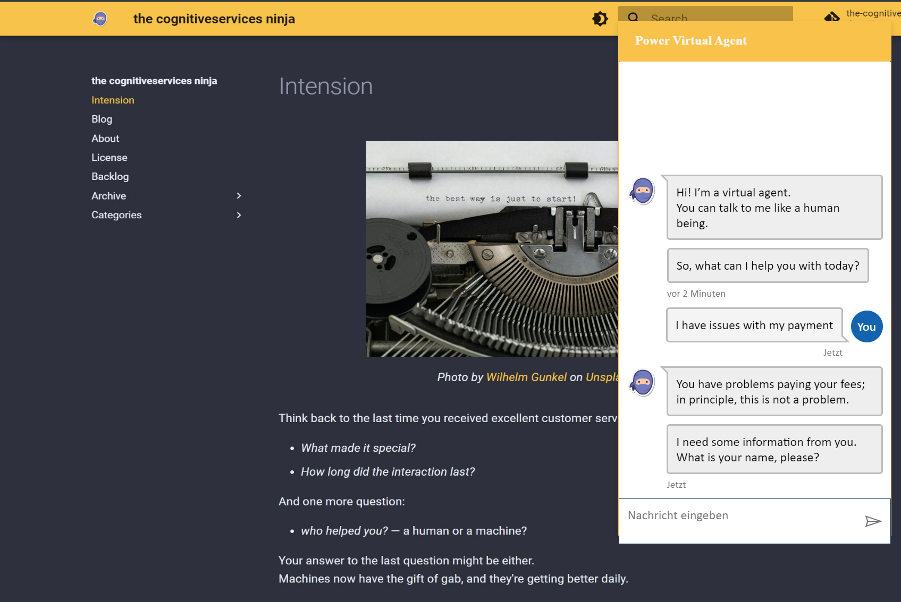

# Webchat integration example for Power Virtual Agent

To integrate your PVA into a website, you could use the [Microsoft Bot Framework Webchat canvas](https://github.com/microsoft/BotFramework-WebChat), which is easily customizable to fit your CI needs ( [Documentation](https://learn.microsoft.com/en-us/power-virtual-agents/customize-default-canvas) ).

